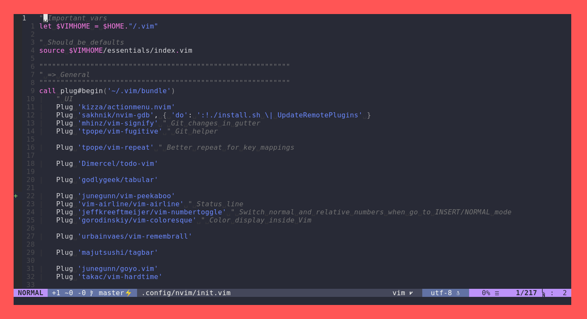

# My Vim config



## Table of contents

<!-- vim-markdown-toc GFM -->

* [Install](#install)

<!-- vim-markdown-toc -->

## Install

First install neovim, and, then: 

```bash
git clone git@github.com:X3z4YkM/nvim.git
cd vim
./install.sh
```

